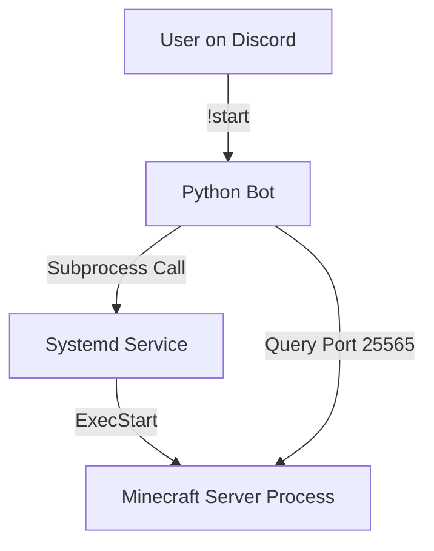

# Entropy's Edge Manager Bot

A lightweight, Python-based Discord bot designed to manage a self-hosted Minecraft server on **Oracle Cloud Infrastructure (OCI) Free Tier**.

This bot acts as a "Watchdog" and "Remote Control," allowing players to wake up the server when they want to play and ensuring it shuts down automatically to save resources when empty.

## 🎯 The Problem

Running a high-performance Minecraft server (PaperMC) on an ARM-based cloud instance is great, but leaving the Java process running 24/7 wastes CPU cycles, fills logs, and can lead to performance degradation over time.

## 💡 The Solution

Instead of shutting down the entire Virtual Machine (which takes minutes to boot and releases the IP address), this bot keeps the lightweight Linux OS running but **stops the heavy Minecraft Java process**.

* **Idle:** ~50MB RAM usage.
* **Active:** ~12GB RAM usage.

## ✨ Features

* **Discord Remote Control:** Start, Stop, and Restart the server directly from a private Discord channel.
* **Automatic Idle Shutdown:** Monitors player count every 10 seconds. If the server is empty for **30 minutes**, it kills the Java process to save resources.
* **Live Player Notifications:** Posts messages when players join (`👋`) or leave (`🚪`).
* **Lag-Free Restart:** Provides a `!restart` command to flush RAM and clear lag spikes without SSH access.
* **Smart Status:** `!status` command shows a live player list, latency, and RAM usage.

---

## 🏗 Architecture

The bot runs on the **same machine** as the Minecraft server (localhost). It interacts with the OS using `systemd` commands via `sudo`.



---

## ⚙️ Prerequisites

* **OS:** Ubuntu 24.04 LTS (ARM64 recommended, but works on x86).
* **Python:** 3.10 or newer.
* **Minecraft Server:** Must be set up as a systemd service (e.g., `minecraft.service`).
* **Permissions:** The user running the bot must have `sudo` privileges for specific `systemctl` commands.

---

## 🚀 Installation

### 1. Clone the Repo

```bash
cd ~
git clone https://github.com/YourUsername/minecraft-manager-bot.git bot
cd bot

```

### 2. Set up Python Environment

Use a virtual environment to keep dependencies clean.

```bash
python3 -m venv venv
source venv/bin/activate
pip install -r requirements.txt

```

*(Note: Create a `requirements.txt` with: `discord.py` and `mcstatus`)*

### 3. Configuration

Rename `config.example.py` to `config.py` (or edit the top of `bot.py`) and set your variables:

* `TOKEN`: Your Discord Bot Token.
* `CHANNEL_ID`: The ID of the private admin channel.
* `IDLE_LIMIT_MINUTES`: Time to wait before auto-sleep (Default: 30).

---

## 🔐 System Configuration (Crucial)

For the bot to start/stop the server without asking for a password, you must edit the sudoers file.

1. Run `sudo visudo`.
2. Add the following line to the bottom (replace `ubuntu` with your Linux username):

```bash
ubuntu ALL=(ALL) NOPASSWD: /usr/bin/systemctl start minecraft, /usr/bin/systemctl stop minecraft, /usr/bin/systemctl restart minecraft, /usr/bin/systemctl status minecraft, /usr/bin/systemctl is-active minecraft

```

---

## 🤖 Usage

Run the bot manually for testing:

```bash
source venv/bin/activate
python bot.py

```

### Deploy as a Service (Auto-Start)

To keep the bot running 24/7 (even after reboots), install it as a systemd service.

1. Copy the service file:
`sudo cp discordbot.service /etc/systemd/system/`
2. Reload and Start:

```bash
sudo systemctl daemon-reload
sudo systemctl enable discordbot
sudo systemctl start discordbot

```

---

## 🎮 Commands

| Command | Description |
| --- | --- |
| `!start` / `!wake` | Starts the Minecraft server service. |
| `!stop` / `!sleep` | Safely stops the server. |
| `!restart` | Reboots the Java process (Fixes lag). |
| `!status` | Shows "Online/Offline", player count, and latency. |

---

## 🛠 Troubleshooting

* **Bot says "Permission Denied":** Check your `visudo` configuration. The path to systemctl must be exact (`/usr/bin/systemctl`).
* **Bot crashes on start:** Ensure `CHANNEL_ID` is an Integer, not a String.
* **Status command fails:** Ensure `server-ip` is blank in `server.properties` and the bot is checking `127.0.0.1` or `localhost`.
